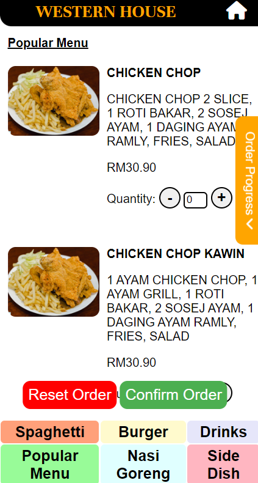
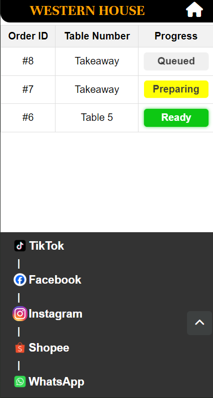
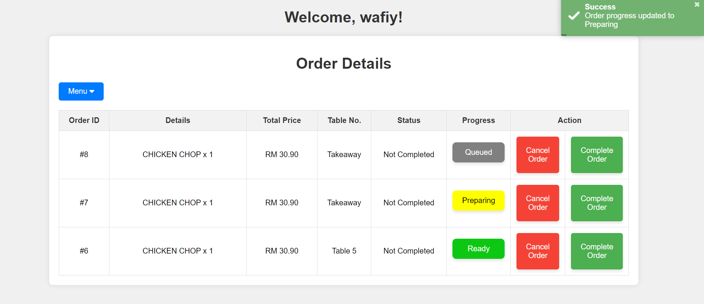
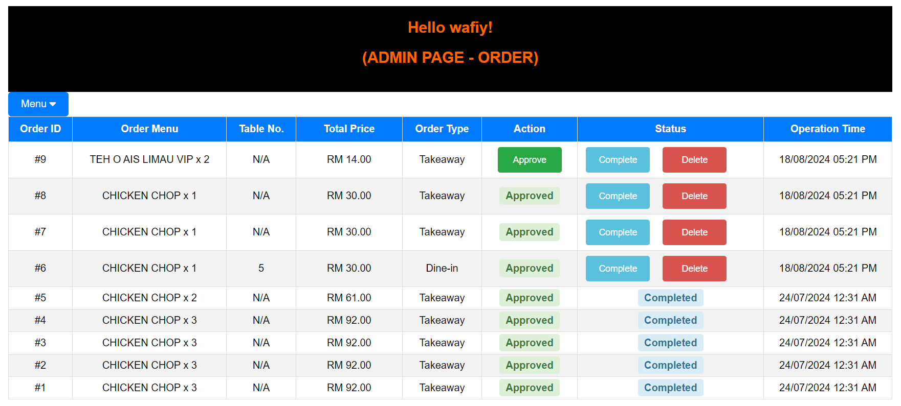

# Food-Ordering System

This food-ordering system is developed as a Final Year Project (FYP) to streamline the process of managing orders in a restaurant. The system is designed for three primary users: Admin, Chef, and Customer. It includes features for handling orders, tracking order status, and printing invoices.

## Table of Contents

1. [Features](#features)
   - [Admin](#admin)
   - [Chef](#chef)
   - [Customer](#customer)
   - [Order Status](#order-status)
   - [Printing Invoice](#printing-invoice)
2. [Installation](#installation)
3. [Database Schema](#database-schema)
4. [Contributing](#contributing)
5. [License](#license)

## Overview

### Customer Page


### Order Progress Status


### Chef Page


### Admin Page


## Features

### Admin

- **Order Management:** Admin can view and manage all orders placed by customers. They have the ability to approve or reject orders.
- **User Management:** Admin can manage staff details, ensuring that staff names and usernames are unique.
- **Order Menu:** Admin can manage the order menu, setting the available items for customers to order.
- **Real-Time Updates:** The system reloads customer progress when an order is approved or its progress is updated.

### Chef

- **Order Processing:** Chefs can view the orders that need to be prepared. The system shows the status of each order (e.g., Pending, Preparing, Delivered).
- **Order Status Updates:** Chefs can update the status of an order once it has been prepared, allowing real-time updates for both the customer and the admin.

### Customer

- **Order Placement:** Customers can place orders through the system, specifying the items they want from the menu.
- **Order Tracking:** Customers can track the status of their orders (Pending, Preparing, Delivered).
- **Invoice Generation:** Customer can generate and print invoices for orders, with custom formatting for order and quantity details.
- **Invoice Access:** Once an order is delivered, customers can view and print their invoice.

### Order Status

- **Status Tracking:** The system tracks each order's status, from the moment it is placed to its delivery.
- **Progress Update:** The system includes a progress tracker that is updated in real-time as the order moves through different stages 
(Queued, Preparing, Ready).

### Printing Invoice

- **Invoice Generation:** After the order is completed, the system allows for the generation and printing of an invoice.
- **Custom Formatting:** The invoice format includes specific sections for order details, quantities, and prices.

## Installation

To set up the project, clone the repository and configure the environment variables, particularly the database connection.

```bash
git clone https://github.com/zunnurw/food-ordering-system-fyp.git
cd food-ordering-system-fyp

Ensure that the .env file is properly configured with your database credentials.

## Database Schema

The database schema includes the following tables:

### `admin_panel`
- `id` (Primary Key, int)
- `order_menu` (mediumtext): Details of the order menu.
- `table_no` (varchar): Table number associated with the order.
- `total_price` (decimal): Total price of the order.
- `order_type` (varchar): Type of order (e.g., dine-in, takeout).
- `action` (enum: 'Pending', 'Approved', 'Rejected'): Status of the action taken.
- `status` (varchar): Current status of the order.
- `operation` (timestamp with default and auto-update settings): Timestamp of the operation.

### `menu_items`
- `id` (Primary Key, int)
- `name` (varchar): Name of the menu item.
- `description` (text): Description of the menu item.
- `price` (decimal): Price of the menu item.
- `category` (varchar): Category of the menu item (e.g., appetizer, main course).
- `image` (varchar): URL or path to the image of the menu item.

### `order_details`
- `order_id` (Primary Key, int)
- `order_item` (varchar): Item ordered.
- `total_price` (decimal): Total price for the order.
- `table_number` (varchar): Table number for the order.
- `order_status` (varchar): Status of the order (e.g., Pending, Preparing, Delivered).
- `progress` (enum: 'Pending', 'Preparing', 'Delivered', ''): Progress status of the order.

### `staff_details`
- `id` (Primary Key, int)
- `staff_name` (varchar): Name of the staff member.
- `username` (varchar): Unique username for the staff member.
- `password` (varchar): Password for the staff member.
- `job` (varchar): Job title or role of the staff member.

Contributing
Contributions are welcome. Please fork the repository and submit a pull request for any features or bug fixes.

License
This project is licensed under the MIT License.

### Steps to Add the `README.md` to Your Repository

1. **Create the `README.md` File:**
   - Open your project directory and create a file named `README.md`.
   - Copy and paste the above content into the file.

2. **Add the `README.md` to Git:**
   ```bash
   git add README.md